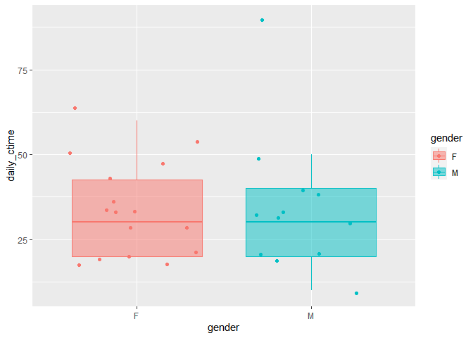
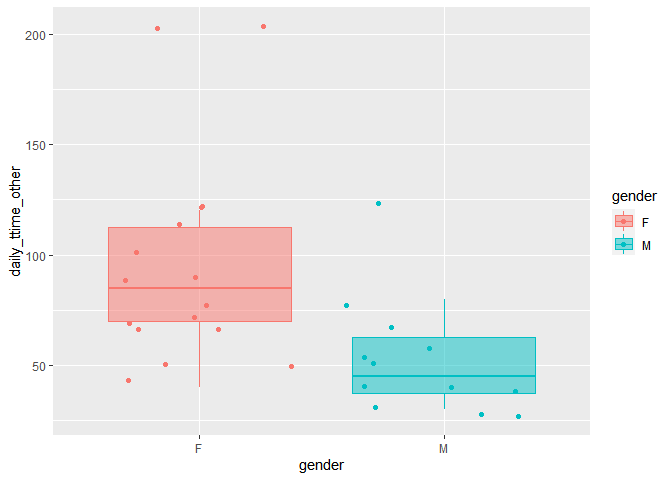
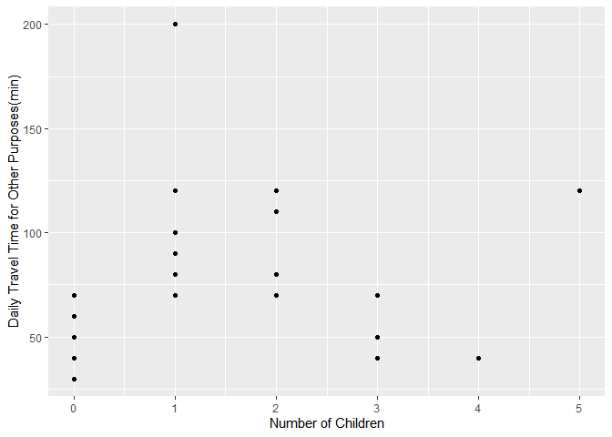
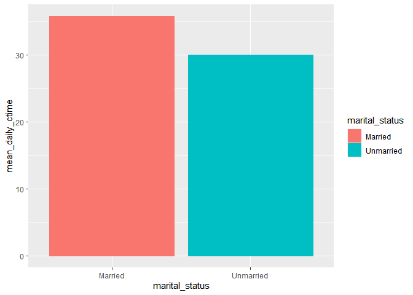
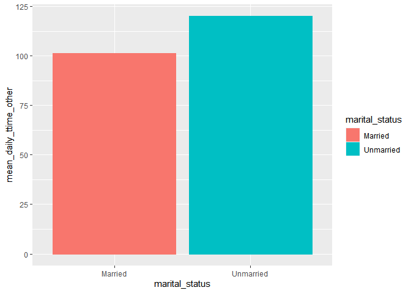

final
================
Soojung
4/2/2022

### Load Packages

``` r
library(tidyverse)
library(knitr)
library(ggplot2)
```

### Load Data

#### Low income households: car ownership and travel

#### 1. Descriptive statistics

#### 2. The travel time of commute/non-commute travel by gender

``` r
ggplot(data = interview_data, aes(x = gender, y = daily_ctime, color=gender, fill=gender))+
  geom_boxplot(outlier.shape = NA, alpha=0.5) +
  geom_jitter()
```

<!-- -->

``` r
ggplot(data = interview_data, aes(x = gender, y = daily_ttime_other, color=gender, fill=gender))+
  geom_boxplot(outlier.shape = NA, alpha=0.5) +
  geom_jitter()
```

<!-- -->

#### 3. Scatterplot: correlation between travel time and children

``` r
ggplot(data = interview_data) + 
  geom_point(mapping = aes(x=children, y=daily_ttime_other)) +
  labs(x="Number of Children", y="Daily Travel Time for Other Purposes(min)")
```

<!-- -->

#### 4.single mothers with child with cars \<-> married mothers with child with cars

``` r
interview_data %>%
  filter(children>0 & gender=="F" & Own_car=="yes") %>%
  group_by(marital_status) %>%
  summarise_at(vars(daily_ctime, daily_ttime_other), funs(mean))%>%
  rename('mean_daily_ctime' = daily_ctime,'mean_daily_ttime_other' = daily_ttime_other) %>%
  kable()
```

| marital_status | mean_daily_ctime | mean_daily_ttime_other |
|:---------------|-----------------:|-----------------------:|
| Married        |         35.71429 |               101.4286 |
| Unmarried      |         30.00000 |               120.0000 |

#### 4.2. Visualization

``` r
driving_mothers <-interview_data %>%
  filter(children>0 & gender=="F" & Own_car=="yes") %>%
  group_by(marital_status) %>%
  summarise_at(vars(daily_ctime, daily_ttime_other), funs(mean))%>%
  rename('mean_daily_ctime' = daily_ctime,'mean_daily_ttime_other' = daily_ttime_other)

  ggplot(driving_mothers, aes(x=marital_status, y=mean_daily_ctime, color=marital_status,fill=marital_status)) +
  geom_bar(stat='identity')
```

<!-- -->

``` r
  ggplot(driving_mothers, aes(x=marital_status, y=mean_daily_ttime_other, color=marital_status,fill=marital_status)) +
  geom_bar(stat='identity')
```

<!-- -->

#### 5. used cars and repairs

``` r
new_data <- interview_data %>% mutate(used = Car_acq)
new_data$used[new_data$used=="gifted"] = "used"
new_data %>% select(used, repairs) %>% 
  group_by(used, repairs)  %>% 
  tally() %>% 
  spread(repairs, n)
```

    ## # A tibble: 3 x 4
    ## # Groups:   used [3]
    ##   used  `n/a`    no   yes
    ##   <chr> <int> <int> <int>
    ## 1 n/a       4    NA    NA
    ## 2 new      NA     2     1
    ## 3 used     NA     1    20
